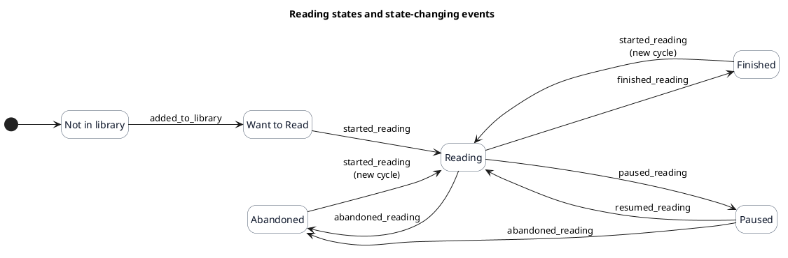

# Reading states and events

Note that in the database, we store the reading states as reading shelves; reading state is the domain language, but as
data we see them as shelves, as they share a lot with custom shelves.

## States

| State        |
|--------------|
| Want to Read |
| Reading      |
| Paused       |
| Finished     |
| Abandoned    |

**Not in library** is not a reading state. Removing a book removes its user-library record and every shelf placement.

## Source of truth

The reading-shelf placement is the source of truth for the current reading state. Events are just used for history;
though we try to enforce that the events are consistent with the shelf placement.

## Allowed transitions

This was generated with `plantuml-1.2026.6.jar`.
